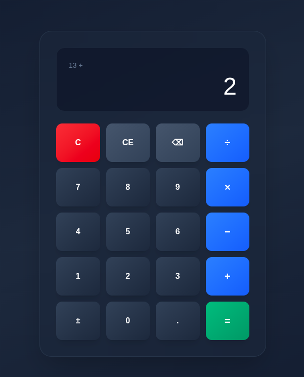

# Calculadora Next.js

Uma calculadora moderna e funcional desenvolvida com Next.js, TypeScript e Tailwind CSS.




## Sobre o Projeto

Este é meu primeiro projeto em Next.js! Desenvolvi esta calculadora para aprender os fundamentos do framework e criar uma aplicação funcional do zero. Todo o código Next.js, a lógica da calculadora e a estrutura do projeto foram implementados por mim.

### Funcionalidades

- Operações básicas: adição, subtração, multiplicação e divisão
- Suporte a números decimais
- Função backspace para corrigir entrada
- Inversão de sinal (positivo/negativo)
- Botões C (clear) e CE (clear entry)
- Interface responsiva
- Design moderno

## Começando

### Pré-requisitos

- Node.js 18 ou superior
- npm ou yarn

### Instalação

```bash
# Clone o repositório
git clone [seu-repositorio]

# Entre na pasta do projeto
cd calculadora

# Instale as dependências
npm install

# Execute o projeto em modo desenvolvimento
npm run dev
```

Abra [http://localhost:3000](http://localhost:3000) no navegador.

## Tecnologias Utilizadas

- **Next.js 14** - Framework React para aplicações web
- **TypeScript** - JavaScript com tipagem estática
- **Tailwind CSS** - Framework CSS utilitário
- **React Hooks** - useState para gerenciamento de estado

## Como Usar

1. Clique nos números para inserir valores
2. Selecione uma operação (+, -, ×, ÷)
3. Insira o segundo número
4. Pressione = para calcular o resultado
5. Use C para limpar completamente ou CE para limpar apenas a entrada atual
6. O botão ⌫ remove o último dígito digitado

## Estrutura do Código

A calculadora utiliza React Hooks para gerenciar o estado:

- `display`: valor mostrado na tela
- `previous`: valor anterior para operações
- `operation`: operação selecionada (+, -, ×, ÷)
- `resetDisplay`: flag para controlar quando resetar o display

Todas as funções de cálculo e manipulação de estado foram desenvolvidas do zero como parte do aprendizado de Next.js.

## Créditos

**Desenvolvimento:** Todo o código Next.js, lógica da aplicação e funcionalidades foram desenvolvidos por mim como projeto de aprendizado.

**Assistência de Design:** Kiro IA auxiliou com sugestões de paleta de cores, gradientes CSS e escolha de alguns ícones para os botões.

## Licença

Este projeto está sob a licença MIT.

## Autor

Projeto desenvolvido como primeiro contato com Next.js.
